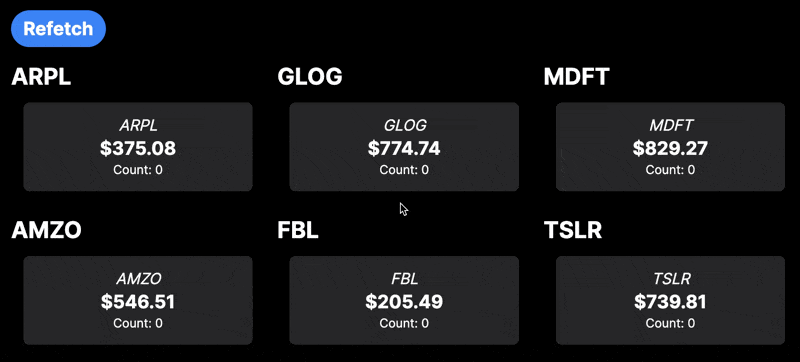

This is an experiment in sending a stream of components and data back from a NextJS App Router application using a server action that supports a psuedo-streaming methodology.

The Vercel AI library has a fascinating feature that allows you to [send back a stream of components and data from a server action](https://sdk.vercel.ai/docs/api-reference/streaming-react-response). It's a really great feature, but it's hard wound around using an AI to drive the stream. I wanted to see if I could create a library that would allow you to send back a stream of components and data without having to use any AI service integration (or any particular service integration at all).

## Proof Of Concept

The idea is simple, we have a set of stock values that we want to show as soon as we have the data. Some requests take longer than others and we want to display the results as soon as we have them. We also want the server to handle returning the appropriate component for rendering.

This video shows the proof of concept in action:



Each of the stocks has a different amount of lag in getting data from the service, but we want to get all the stocks and get each as soon as it's available. In the example the `getStocks` server action simulates the lag by using `setTimeout` to delay the response for each of the simulated stocks. And then uses the generic `buildStreamedResponse` function to build the streaming response that will go to the client.

The `Dashboard` component then uses the `useStreamingResponse` hook to handle the streaming response and render the components as they come in.

## Advantages Over The Vercel/AI Approach

- This approach is disconnected from AI. You can put whatever kind of requests you want into the array of requests. In this case we send back an object with the name of the stock, the price, and then a `ui` property that holds the rendered component.
- You can send back a combination of data and UI components, not just UI.

## Important Files

- `lib/getStocks.tsx` - The server action that returns the stream of components and data.
- `components/Dashboard.tsx` - The component that renders the stream of components and data.
- `components/StockWithCounter.tsx` - The component that renders the stock data and has a counter to demonstrate that the component is rendered on the client.
- `streaming-lib/client.ts` - Holds the `useStreamingResponse` custom hook that handles the streaming response.
- `streaming-lib/server.ts` - Holds the `buildStreamedResponse` that takes the array of promises with IDs and then manages the streaming with the client hook.
- `streaming-lib/types.ts` - Holds the types for the streaming library.

## Getting Started

First, run the development server:

```bash
npm run dev
# or
yarn dev
# or
pnpm dev
# or
bun dev
```

Open [http://localhost:3000](http://localhost:3000) with your browser to see the result.
